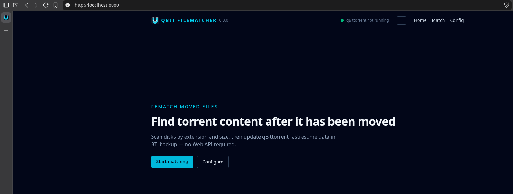

# qBit Filematcher

Rematch on-disk files to qBittorrent torrents after content has been moved.

It works directly on qBittorrent's `BT_backup` directory (paired `.torrent` / `.fastresume` files). There is **no** qBittorrent Web API dependency.

One binary, two modes:

| Mode | Command | Stack |
|------|---------|-------|
| CLI | `qbit-filematcher match` / `config` | flags / prompts |
| WEB | `qbit-filematcher web` | HTMX + Alpine.js + Tailwind CSS |



## Install

Download a release for your OS/arch from [GitHub Releases](https://github.com/styper/qbit-filematcher-go/releases).

Put the binary on your `PATH`, or run it from the extracted directory.

## What it does

1. Load torrents from `BT_backup`
2. Optionally filter by hash / name / tags
3. Scan configured search paths for candidates matched by **extension + size**
4. Select among candidates (interactive, `--auto`, or WEB UI)
5. Compute a NoSubfolder-style `save_path` + `mapped_files`
6. Rewrite `.fastresume` (with timestamped backup), preferably while qBittorrent is closed

## Configuration

Config file: `qbit-filematcher.yaml`. Lookup order:

1. `--config` path (if set)
2. `<binary-dir>/qbit-filematcher.yaml` (portable / next to the executable)
3. OS user config dir:
   - Linux: `$XDG_CONFIG_HOME/qbit-filematcher/qbit-filematcher.yaml` (default `~/.config/…`)
   - macOS: `~/Library/Application Support/qbit-filematcher/qbit-filematcher.yaml`
   - Windows: `%APPDATA%\qbit-filematcher\qbit-filematcher.yaml`

New saves go to the user config path when no file exists yet.

Persisted keys:

- `bt_backup_location`
- `search_paths`
- `exclude_dirs`
- `host` / `port` (WEB)

## CLI

Run `qbit-filematcher --help` (or `qbit-filematcher <command> --help`) anytime for the same text.

### Root

```text
qbit-filematcher rematches on-disk files to qBittorrent torrents via BT_backup (no Web API).

Usage:
  qbit-filematcher [command]

Examples:
  qbit-filematcher match -b ~/.local/share/data/qBittorrent/BT_backup -s /data/media --auto
  qbit-filematcher match --dry-run -s /data/media
  qbit-filematcher config view
  qbit-filematcher web --host localhost --port 8080

Available Commands:
  completion  Generate the autocompletion script for the specified shell
  config      View, edit, or remove persisted settings
  help        Help about any command
  match       Scan disk and update fastresume files
  version     Print version
  web         Start the web UI server

Flags:
      --config string   path to qbit-filematcher.yaml (default: next to binary, then user config dir)
  -h, --help            help for qbit-filematcher
  -v, --version         version for qbit-filematcher

Use "qbit-filematcher [command] --help" for more information about a command.
```

| Command / flag | Meaning |
|----------------|---------|
| `match` | Scan search paths and update `.fastresume` files (main workflow). |
| `config` | View, interactively edit, or delete persisted settings. |
| `web` | Start the embedded WEB UI (`serve` is an alias). |
| `version` | Print the binary version. |
| `completion` | Generate shell completion scripts (bash / zsh / fish / powershell). |
| `help` | Show help for any command. |
| `--config` | Explicit path to `qbit-filematcher.yaml` (otherwise binary-dir, then user config dir). |
| `-h` / `--help` | Show help. |
| `-v` / `--version` | Same as `version`. |

### `match`

```text
Scan disk and update fastresume files.

Path settings come from the config file; flags below override when set.
After merge, --bt-backup and at least one --search path are required.

Usage:
  qbit-filematcher match [flags]

Examples:
  qbit-filematcher match -b ~/.local/share/data/qBittorrent/BT_backup -s /data/media --auto
  qbit-filematcher match --dry-run -s /data/media
  qbit-filematcher match -s /data/media -s /mnt/nas/media
  qbit-filematcher match -s "/data/My Media" -s /mnt/nas/media

Config Overrides:
  -b, --bt-backup string      BT_backup directory (overrides config; required after merge)
  -s, --search stringArray    search path (repeatable; overrides config; required after merge)
  -e, --exclude stringArray   directory name to exclude (repeatable; overrides config)

Flags:
      --auto         auto-select best candidates when multiple matches exist
      --incomplete   allow incomplete torrents
      --dry-run      print plans without writing fastresume files

Filters:
  -a, --hash stringArray   torrent hash v1 filter (repeatable)
  -t, --tag stringArray    tag filter (repeatable; all tags required)
  -n, --name stringArray   name token filter (repeatable)

Global Flags:
      --config string   path to qbit-filematcher.yaml (default: next to binary, then user config dir)
```

| Flag | Meaning |
|------|---------|
| `-b` / `--bt-backup` | qBittorrent `BT_backup` directory. Overrides config; required after merge with config. |
| `-s` / `--search` | Root directory to scan for candidate files. Repeatable; overrides config; at least one required after merge. |
| `-e` / `--exclude` | Directory **name** to skip while scanning (e.g. `.trash`, `.git`). Repeatable; overrides config. |
| `--auto` | When several candidates match a torrent file, pick the best automatically instead of prompting. |
| `--incomplete` | Include incomplete torrents; saving clears piece data so qBittorrent rechecks on next start. |
| `--dry-run` | Print the planned `save_path` / `mapped_files` changes without writing. Skips the “qBittorrent must be closed” check. |
| `-a` / `--hash` | Only process torrents whose v1 info-hash matches (repeatable). |
| `-t` / `--tag` | Only process torrents that have **all** listed tags (repeatable). |
| `-n` / `--name` | Only process torrents whose name contains each token (repeatable). |

Without `--auto`, the CLI prompts when a file has multiple candidates. Saves are refused while qBittorrent appears to be running (unless `--dry-run`).

### `config`

```text
View, edit, or remove persisted settings

Usage:
  qbit-filematcher config [command]

Available Commands:
  edit        Interactively edit settings
  remove      Delete the config file
  view        Print current settings

Flags:
  -h, --help   help for config

Global Flags:
      --config string   path to qbit-filematcher.yaml (default: next to binary, then user config dir)

Use "qbit-filematcher config [command] --help" for more information about a command.
```

| Subcommand | Meaning |
|------------|---------|
| `view` | Print the resolved config path and current settings (`bt_backup_location`, `search_paths`, `exclude_dirs`, `host`, `port`). |
| `edit` | Prompt for each setting, then confirm before writing the YAML file. |
| `remove` | Ask for confirmation (`yes`), then delete the config file. |

### `web`

```text
Start the web UI server

Usage:
  qbit-filematcher web [flags]

Aliases:
  web, serve

Flags:
  -h, --help          help for web
  -o, --host string   listen host (default: from config or localhost)
  -p, --port int      listen port (default: from config or 8080)

Global Flags:
      --config string   path to qbit-filematcher.yaml (default: next to binary, then user config dir)
```

| Flag | Meaning |
|------|---------|
| `-o` / `--host` | Listen address. Defaults to config `host`, else `localhost`. |
| `-p` / `--port` | Listen port. Defaults to config `port`, else `8080`. |

## WEB

```bash
qbit-filematcher web --host localhost --port 8080
```

Pages: `/` home, `/config`, `/match` (scan + list), `/match/{hash}` (select candidates + save).

### Match list (`/match`)

Filter the table with a **name / hash / tag** search box and **Match Status** pills (`All` / `Changed` / `Partial` / `Current` / `None`). Filters and column sort persist for the browser tab until you run a new Scan.

Select torrents with checkboxes (header checkbox = all **visible** rows), then **Start queue** to walk them one-by-one on the detail page. Queue order follows the current table sort; already-Current rows are omitted. On each detail screen, Save advances to the next item; use Skip / Back / Leave queue as needed. Progress is shown as “N of M”. The queue is stored in the tab’s `sessionStorage` and cleared on Scan, Leave queue, or when finished.

**Match Status** column (colored dot + short label; hover for the full description):

| Display | Meaning |
|---------|---------|
| ● Current (green) | All files matched; selected paths already match the fastresume (nothing to save) |
| ● Changed (amber) | All files matched; at least one selected path differs from the fastresume |
| ● Partial (slate) | Some files have candidates; others are still unmatched |
| ● None (red) | No on-disk candidates found for any file |

### Torrent detail (`/match/{hash}`)

**File card background:**

| Look | Meaning |
|------|---------|
| Green tint | Exactly one candidate for that file (unambiguous) |
| Amber tint | Multiple candidates — pick one |
| Rose tint / ring | Selected path conflicts with another file (duplicate selection) |
| Default | Zero candidates |

**Candidate `selected` / `select` buttons:**

| Look | Meaning |
|------|---------|
| Cyan border | Currently selected, and it is still the auto-picked choice |
| Green border | Currently selected, but you overrode the auto pick |
| Slate border | Not selected (`select`) |

**Save fastresume** is green when every file has exactly one candidate; cyan otherwise. It stays disabled when Match Status is Current (no-op save), when it is None, or when Partial needs **Allow incomplete**.

## Safety notes

- Every fastresume update writes a timestamped `.bak` beside the original.
- Saves refuse to run while qBittorrent appears to be running (CLI/WEB and library default).
- Incomplete matches (when allowed) clear piece data so qBittorrent rechecks on next start.

## License

[Unlicense](LICENSE) (public domain dedication). See [NOTICE](NOTICE) for third-party overview.

## Development

Build from source, library usage, and checks: see [CONTRIBUTING.md](CONTRIBUTING.md).
